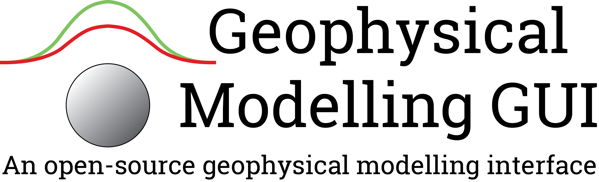

.. raw:: html

    

        <a href="http://www.github.com/btozer/gmg">Visit the GMG github repository</a>
    

Overview
--------

GMG is an open-source Graphical User Interface (GUI) designed principally for modelling
2D potential field (gravity and magnetic) profiles. GMG is written in python 2.7 using
wx.python for GUI implementation. GMG makes use of several other open-source python
packages to preform various tasks (see `References <references.html>`_ for a detailed
listing).

The project was instigated after failing to find an adequate open-source option (in which
the source code can be viewed and modified by the user) for performing 2D geophysical
modeling tasks. Inspiration came from fatiando a terra and GMT.

It is anticipated that GMG will also be useful for teaching purposes.

Key features
------------
* Data I/O is made as simple as possible using space delimited ASCII text files.
* Import and display observed topography, gravity and magnetic data.
* Apply filters to observed data.
* Import and display seismic reflection data.
* Add and manipulate model layers (subsurface bodies) using a simple interactive interface.
* “Pinch out/snap” layers against adjacent layers.
* Calculate the predicted gravity anomaly produced by any combination of model layers.
* Calculate the predicted magnetic anomaly produced by any combination of model layers.
* Model magnetic anomalies using induced and/or remanent magnetism.
* Display well horizon tops.
* Display XY data (e.g., earthquake hypocenters or geological surface contacts).
* Export model data (e.g., predicted anomalies and layer geometries) as ASCII text files.
* Save model figures as vector graphics in Portable Document Format (PDF) file.

.. toctree::
    :maxdepth: 2
    :hidden:
    :caption: Getting Started

    installation
    getting_started

.. toctree::
    :maxdepth: 2
    :hidden:
    :caption: User Guide

    manual
    tutorial
    contribute

.. toctree::
    :maxdepth: 2
    :hidden:
    :caption: Credits

    references
    licence

Release Notes
-------------

Version: |version|

Last updated: |today|

Notices:
--------

Please send comments, feature requests and report all bugs to: btozer@ucsd.edu